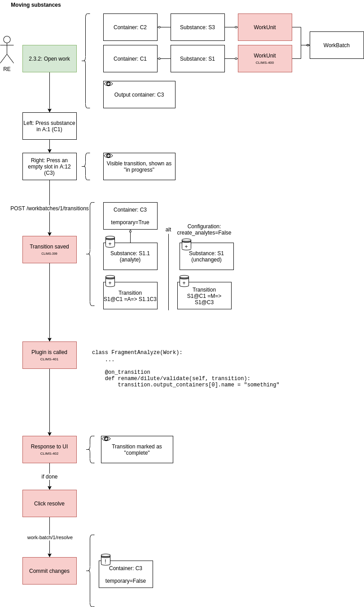
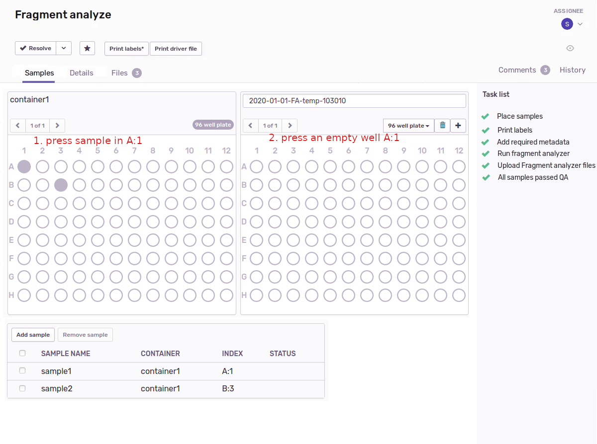
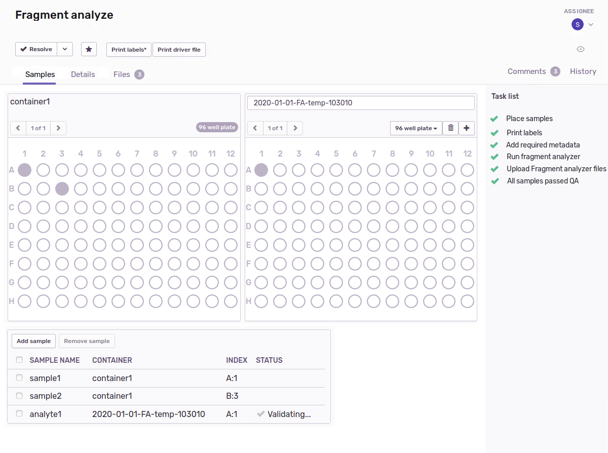
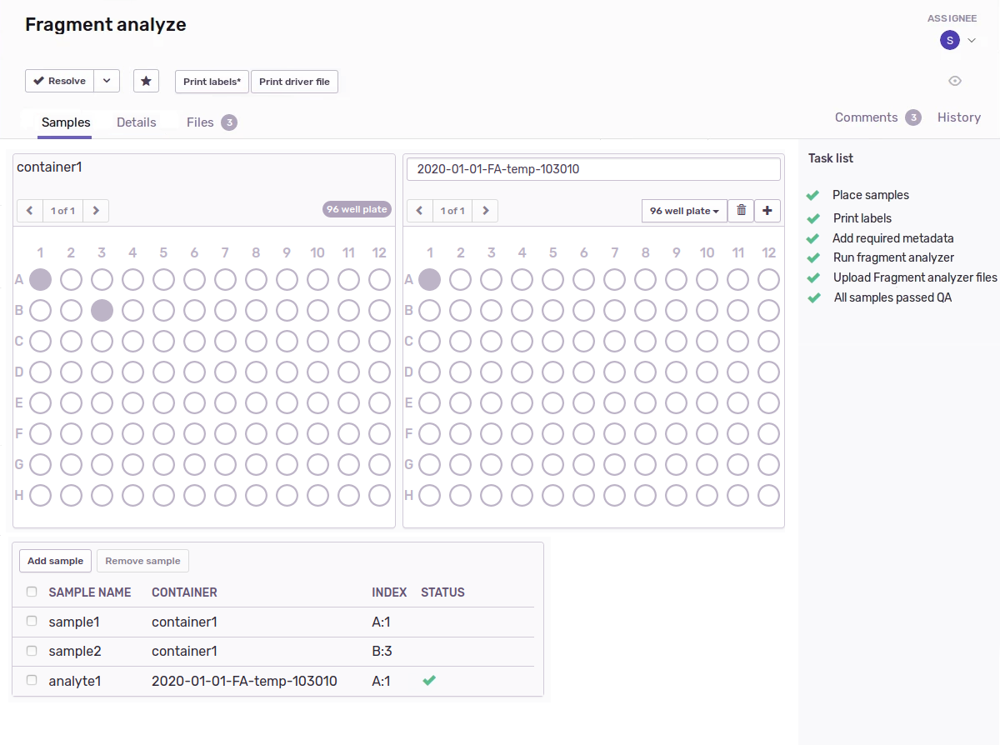

# User can move a sample

The user should be able to move a sample (or any other substance) when in the work view.

## Diagram

## Mockups

They first see this:

Then, after pressing that empty well, they see a message about the sample being validated:

Finally, they see a green flag telling us that the work is done:

